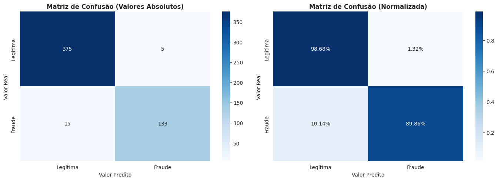

# Detecao de Fraude em Cartao de Credito

- Projeto em Python baseado no dataset publico de transacoes de cartao.
- Conversao de notebook para script executavel fora do Colab.
- Foco em comparar tecnicas de balanceamento e modelos supervisionados.

---

# Desafio e Dados

- Problema classico de deteccao de fraudes com grande desbalanceamento.
- Dataset: transacoes com atributos numericos (PCA) e coluna alvo binaria `Class`.
- Fraudes representam menos de 0.2% das transacoes originais.
- Objetivo: maximizar deteccao de fraudes mantendo poucos falsos positivos.

---

# Desbalanceamento Observado

---

# Desbalanceamento Observado

---

# Pipeline do Script

1. Leitura do CSV informado por argumento `--dataset` ou via prompt.
2. Analise exploratoria: estatisticas, distribuicao e graficos.
3. Padronizacao e selecao de atributos (SelectKBest e RandomForest feature importance).
4. Divisao treino/teste estratificada.

---

# Selecao de Atributos

---

# Selecao de Atributos

---

# Balanceamento e Modelos

- Balanceamento: SMOTE, Random Undersampling e SMOTETomek.
- Modelos base: Decision Tree, Random Forest, Gradient Boosting, SVC, KNN, XGBoost.
- Busca de hiperparametros com GridSearch/RandomizedSearch.
- Ensemble final com VotingClassifier (soft) combinando melhores modelos.

---

# Comparacao de Metricas

---

# Comparacao de Metricas

---

# Resultados e Insights

- Tabelas com macro F1-score, recall e precisao para cada combinacao.
- Matriz de confusao, relatorio de classificacao e curva ROC do melhor modelo.
- Resumo textual destaca ganho de recall apos balanceamento e tuning.
- AUC observada proxima de 0.98 no conjunto de teste balanceado.

---

# Avaliacao do Melhor Modelo

---

# Curva ROC e Evolucao

---

# Curva ROC e Evolucao

---

# Obrigado